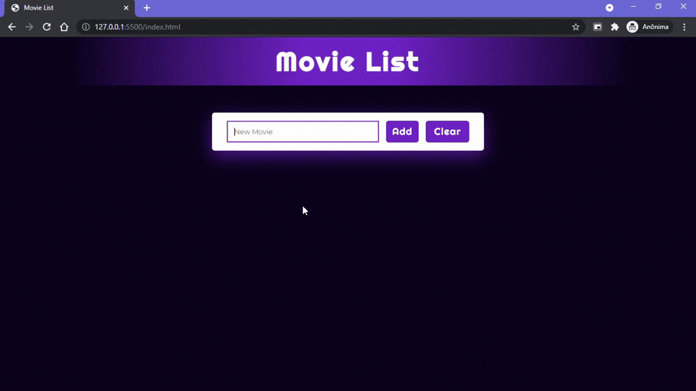

# Movie list

Exercício do curso Estartando Devs que tinha como objetivo criar um CRUD e enviar os dados para o Local Storage.

# Deploy

# Tecnologias utilizadas

- HTML
- CSS
- JavaScript

# Melhorias
- Acrescentar a funcionalidade de excluir 1 item por vez

# Autora

Criado por [Izadora Oliveira](https://github.com/iiizadora)